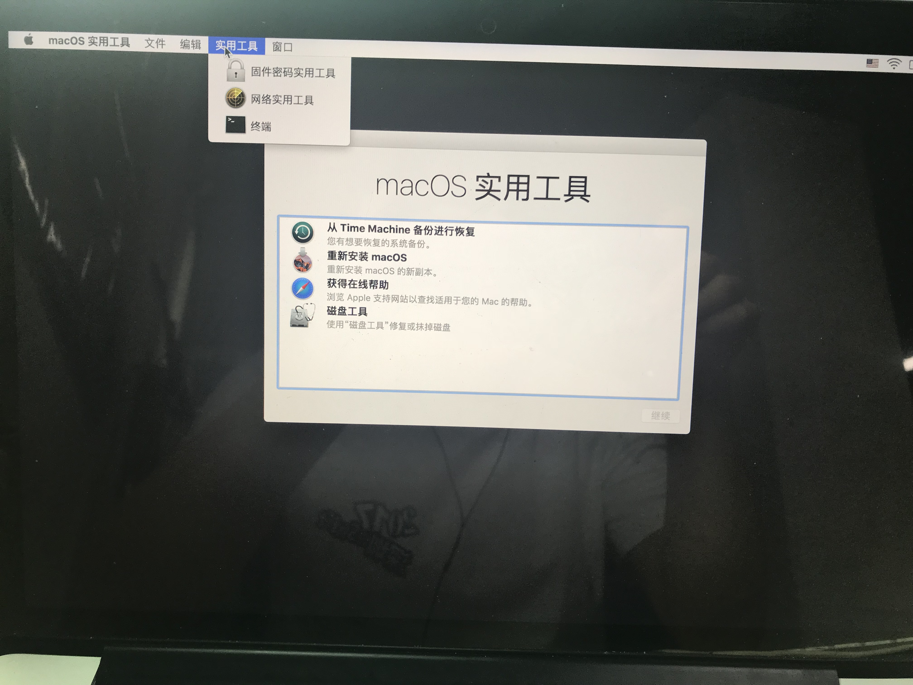

## Arduino + on Mac OS X + USB port（Arduino在Mac系统下的配置说明 驱动安装） + （USB port not listed on Mac OS X ）+（CP210x USB to UART Bridge VCP Drivers）


### 1.   Arduino IDE（Mac）安装

​	官网链接  <https://www.arduino.cc/en/Main/Donate>


下载完后 直接安装。如果提示文件损坏 什么的 进入终端可以是试试 （任意来源程序的安装）

```shell
sudo spctl --master-disable
```


### 2. **注意：** 在安装串口驱动之前，必须禁用kext签名

来自http://blog.csdn.net/yczyd/article/details/78503420

在OS X 10.11下，El Capitan Apple通过引入“系统完整性保护”和新的cli util“csrutil”来改变kext签名的方式。
12
要禁用kext签名，您需要执行以下操作：

* 重新启动并按 CMD + R 进入恢复模式；

* 在恢复模式打开终端；

* 运行命令 csrutil enable --without kext； (这一步我直接设置为  csrutil disable)

* 重启系统，既配置完成。

  

  ​

### 2. How To Use Cheap Chinese Arduinos That Come With With CH340G / CH341G Serial/USB Chip (Windows & Mac OS-X) (CH340串行适配器)

官网地址<https://kig.re/2014/12/31/how-to-use-arduino-nano-mini-pro-with-CH340G-on-mac-osx-yosemite.html>


点击下载完后 会得到 


直接点开pkg 安装  （需要注意的是 先读一下ReadMe.pdf 的文档  安装pkg的时候 按照文档安装基本没有什么问题）


如果安装遇到什么问题 按照下面的解决就可以了 （选择源的那个不需要处理了 因为10以上的系统已经没有那个选项了 我们直接在终端处理了 在第一步的时候）


在终端输入如下

```shell
sudo su
rm -rf /System/Library/Extensions/usbserial.kext
rm -rf /Library/Extensions/usbserial.kext
```


### 3.  USB port not listed on Mac OS X （Mac 无法识别Arduino 的端口号）


这个地方坑了我一个星期 （还以为是老板发给我的板子是坏的） 查了好多国外的资料 后来在git上找到了 

网址<https://github.com/espressif/arduino-esp32/issues/370>


### 4. CP210x USB to UART Bridge VCP Drivers (就是第3步需要下载的)

官网地址<https://www.silabs.com/products/development-tools/software/usb-to-uart-bridge-vcp-drivers>


点击下载得到的是


安装解压后的 dmg就可以了


### 5.  最后需要补充一点  你可能使用的是不同厂家生产的开发版 需要安装一下他们提供的开发版的驱动 你在哪儿买的 直接问下老板就知道 他会把驱动发给你的 

我买的是  Arduino开发板SX1276 ESP32芯片非模块OLED WIFI LoRa节点868-915  （Heltec Automation）

厂家给我的驱动链接<https://github.com/Heltec-Aaron-Lee/WiFi_Kit_series/blob/master/InstallGuide/mac.md>


 这个只是作为参考 不同的厂家 可能不一样


### 6. 然后USB  插上开发版 效果如下


当然你也可以去终端 dev 文件里面看 有没有新的

